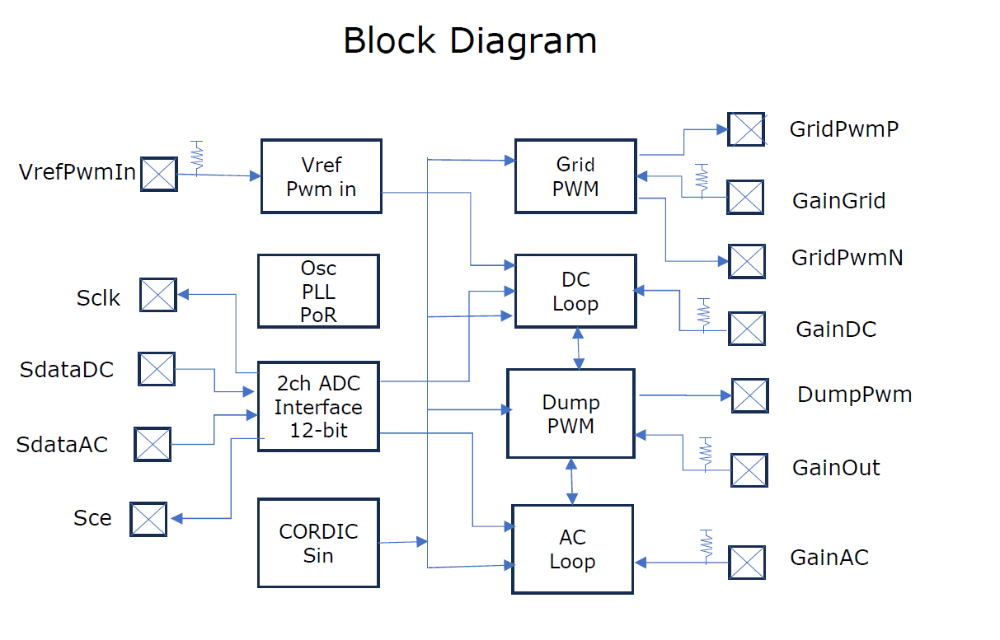
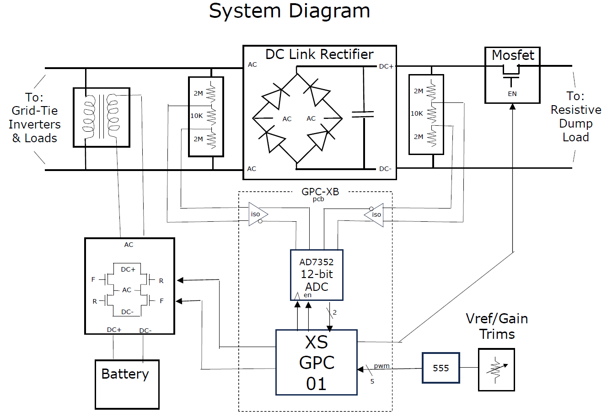
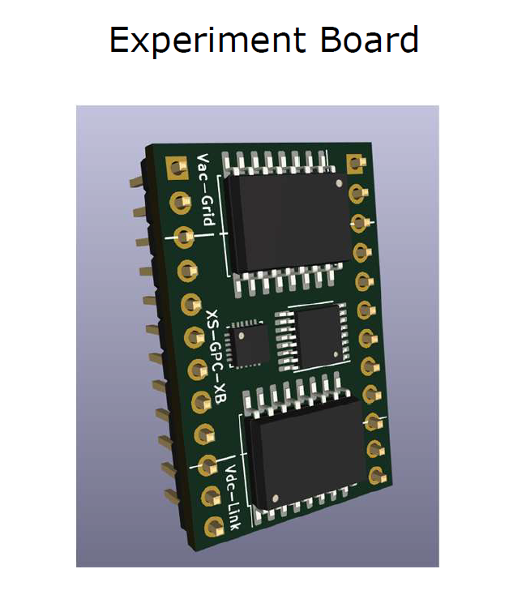
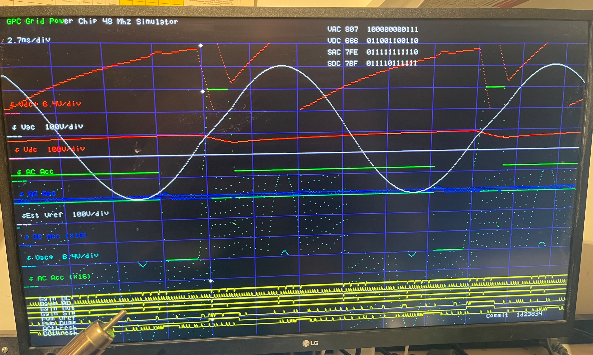

# **60 Hz Grid‑Forming ASIC with DC‑Link Dump‑Load Control**

*A TinyTapeout ASIC for grid‑aware AC generation and power balancing*

This ASIC implements a **self‑contained, grid‑aware control loop** capable of generating a clean 60 Hz reference waveform while simultaneously regulating real‑power flow using a **DC‑link dump load**. It is designed for small AC micro‑systems where PV inverters, a low‑power grid‑former, and a resistive dump load must coexist without external controllers.

The chip senses the AC and DC waveforms, compares DC to a Vref and AC to an internal CORDIC‑generated reference, and adjusts a DC‑side dump FET to maintain long‑term phase and amplitude stability. All control is performed on‑chip using add/shift arithmetic, a fast error accumulator, a slow IIR loop, and a minimum‑pulse‑width PWM engine.



\---
## **Core Features**

* **CORDIC‑locked 60 Hz sine generator**  
Produces a stable, phase‑accurate reference for a low‑power H‑bridge grid‑former.
* **AC/DC sensing (dual ADC input)**  
Samples the AC and DC waveforms at 3 MHz and compares it to the internal reference.
* **AC/DC Dual Loop control**  
Forms linear and stable control loops without multipliers.
* **DC‑link dump‑load PWM output**  
Drives a single high‑voltage FET with enforced **4 µs minimum ON/OFF** times.
* **Four real‑time tuning gates**  
External PWM or logic‑level inputs adjust loop behavior on the fly:

  * `dc_vref` — DC Link Reference voltage input
  * `gain_sine` — trims generated sine amplitude
  * `gain_out` — Output gain trim
  * `gain_ac` — AC gain
  * `gain_dc` — DC gain
  * `mode_ac` — select 1/4 cycle AC operation
* **Safe, simple power topology**  
Intended for use with a **rectified 240 V AC DC‑link** (VFD‑style front end) and a resistive dump load such as a water heater.



\---

## **I/O Summary**

### **Inputs (`ui`)**

```
ui[0]  ac_sdata      # AC ADC serial data input (3 MHz sample stream)
ui[1]  dc_sdata      # DC ADC serial data input (3 MHz sample stream)
ui[2]  dc_vref       # DC Vref target voltage for DC Link
ui[3]  gain_sine     # Sine amplitude trim (generation gain)
ui[4]  gain_out      # Dump-PWM gain trim (max dump power)
ui[5]  gain_ac       # AC Gain trim
ui[6]  error_dc      # DC Gain trim
ui[7]  ac_mode       # Select 1/4 cycle ac mode

```

### **Outputs (`uo`)**

```
uo[0]  adc_cs          # ADC chip-select / sample strobe
uo[1]  gen_pwm_p       # Grid-former PWM (positive leg)
uo[2]  gen_pwm_n       # Grid-former PWM (negative leg)
uo[3]  dump_pwm        # DC-link dump FET PWM (4 µs min pulse width)
uo[4]  (unused)
uo[5]  (unused)
uo[6]  (unused)
uo[7]  (unused)
```

\---

## **Intended Use Case**

This ASIC is designed for experimental AC micro‑systems where:

* a **low‑power grid‑former** establishes the AC waveform
* **PV inverters** inject unpredictable power
* **AC Appliances** use less energy than available
* a **DC‑link dump load** must absorb surplus energy
* the system must remain stable without external controllers

The chip maintains long‑term phase and amplitude alignment by modulating the dump load based solely on AC‑side sensing.

\---

## **Status**

* [Preliminary Datasheet](GPC-01_Datasheet.pdf)
* RTL complete
* Clean synthesis
* Verified P\&R on **1×2 tile**
* Ready for TinyTapeout submission
* verification tests
* Ported to Forge 1k fpga
* Max10 Fpga Simulation Environment





## Why is it?

Use my 10kw grid-tied solar system to power my home on the second day of a power outage.

A grid tied solar system becomes useless without the grid. Hybrid systems involve using batteries fix this, but are a big expense. If a grid tied solar system is disconnected from the grid and provided with a simulated grid the solar system will generate hydro AC. The issue is that grid tied inverters work by maximizing the energy delivery without restriction knowing that the grid can accept it, and it will vary with available sunlight.
If the energy is not dissipated the voltage and frequiency of the simulated grid will be driven out of spec and the grid tied inverters will shutdown (usually for at least 5 min).

The energy from the sun needs to be always and exactly dissipated. This dissipation can be partially done by any electrical devices in the home, but something else needs dissipate the remainder. Heating water is a good way of dumping energy.

A semiconductor chip is proposed which will generate a reference 60Hz AC, and control dumping extra energy into a resistive load without needed a battery system (ref [Datasheet](GPC-01_Datasheet.pdf) ). I design up a minimum usable Schematic and PCB board (kicad files in /pcb).

Its a good fit for a tiny tapeout chip with low I/O count PWM and serial data, and 20ns PWM edge resolution
gives fine control, while maintaiing minimum pulse widths. It also fits a forge 1k otp part.

Fitting this device into a tiny cost would remove all cost from the control part of the problem. Mounted on a little experimental PCB board it would be a $30 control solution.

## How it works

A free running angle counter is input into a cordic rotational block and polarity corrected to calculate a 60Hz sine wave.
The sine wave is gated and then accumulated in PWM modulator produce bi-polar PWM signals which can be used to drive an H Bridge and the low side of a transformer, with the high side providing the grid reference.
The 'grid' is rectified into a DC Link, with PWM switching into a resistive load.
The DC and AC 'grid' voltages are sampled by ADC. AC is compared to the sine wave while DC is compared to a PWM provided DC Vref. AC and DC Loops accumulate the pseudo-energy (dv*dt) error, compared against a positive thresholds and used to gate |sin| to drive a dump FET while guaranteeing minimum PWM pulse widths (4us).

## How to test

    make -B FST=

## External hardware

It will need a real or model system to test:

* Grid-tied solar system, sunlight
* Hbridge and drivers
* Step up transformer
* Bridge Rectifier, DCLink Capactors
* Dump FET and driver
* Resistive Water Heater, water
* ADC with isolated instrumentation.
* external control panel (pwm base loop controls))

### disclaimer

This ASIC is an experimental research design and is not intended for direct connection to mains power or use in certified grid‑tie systems.

